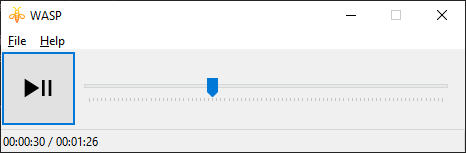

#WASP

WASP is a minimalistic WASAPI Wav Audio Player.

### Features
1. Plays WAV files.
2. Allows to seek within the audio file.
3. Supports drag-and-drop.

### Thanks
1. [Kevin Moran](https://github.com/kevinmoran/BeginnerWASAPI) for the WASAPI examples.
